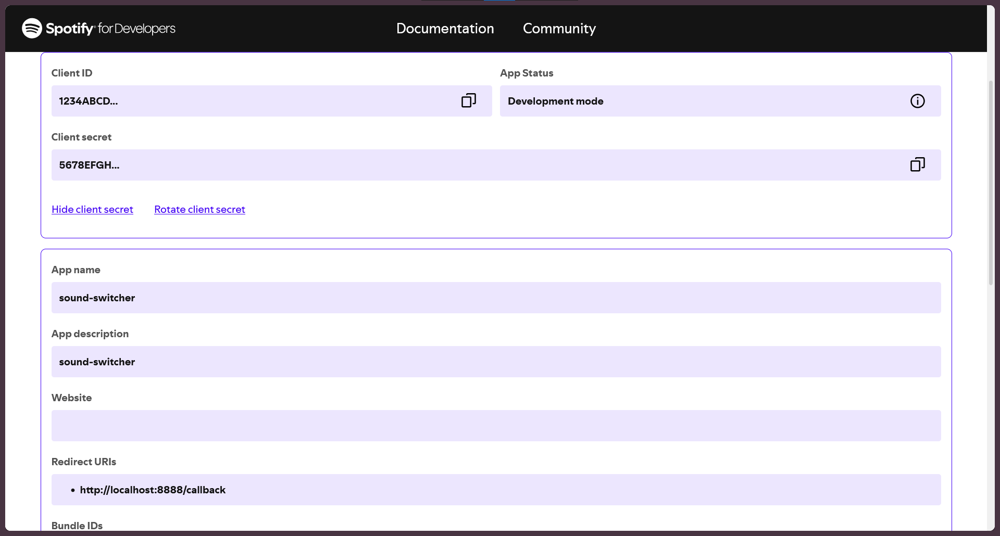

# Spotify-Credentials-Setup

1. Head to the [Spotify Developer Dashboard](https://developer.spotify.com/dashboard)
2. Click "Create app"
3. Give it a name and description
4. Under "Redirect URIs" enter: http://localhost:8888
5. Agree to the Spotify's terms of service
6. Now under "Basic Information" you can copy the "Client ID" and "Client secret"

